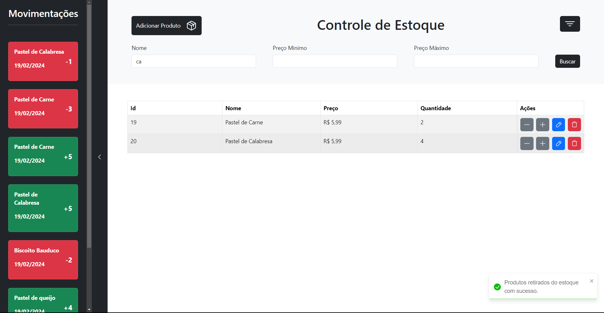
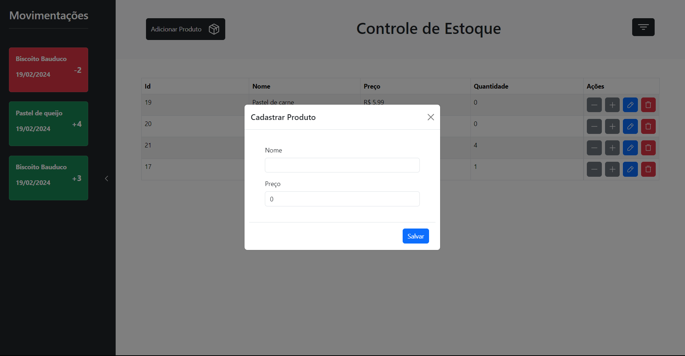
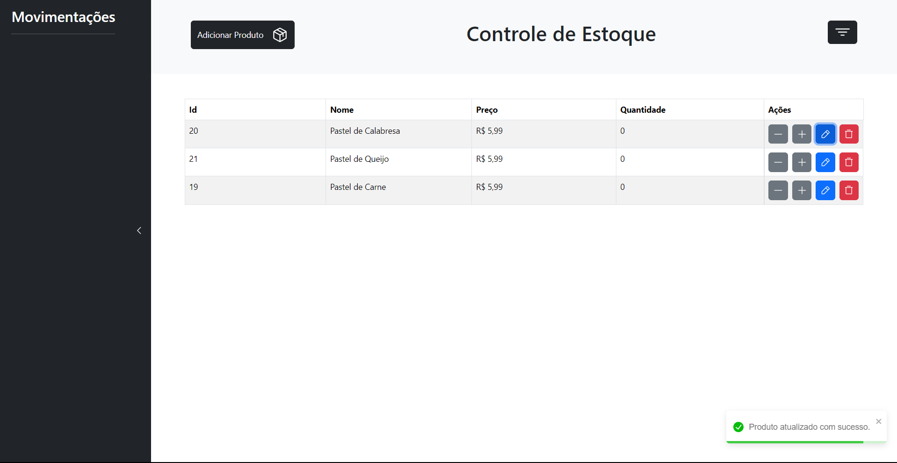

# Stock Control

Project with PostgresSQL for controlling stock of products.

## Technologies

- FastAPI
- PostgresSQL
- ReactJS (with TypeScript)
- Bootstrap

## Design

## API Endpoints

For see all the documentation on swagger access `/docs` endpoint.

- Product
  - Search Products: GET    - `/product`
  - Create Product : POST   - `/product`
  - Update Product : PUT    - `/product/{id}`
  - Delete Product : DELETE - `/product/{id}`
  
- Stock
  - History Stock  : GET    - `/stock/history`
  - Input Stock    : POST   - `/stock/in`
  - Output Stock   : DELETE - `/stock/out`

## How to run local

### With Docker

1. Build the repository image:
> `docker compose build`
2. Run the container:
> `docker compose up -d`

Finish! Now the application are running in your machine!
